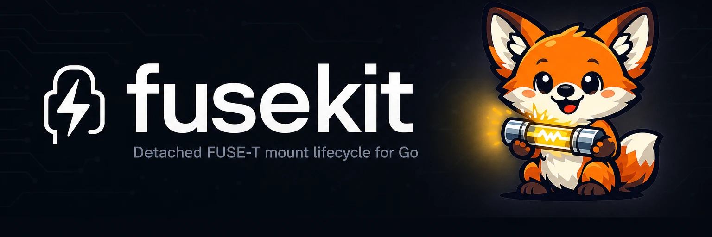

# 

FuseKit is a revisioned filesystem runtime for signed macOS applications. One
catalog owns object identity, namespace transactions, immutable content
snapshots, and change history. Mount and File Provider are two presentations of
that same state.

[](https://github.com/yasyf/fusekit/actions/workflows/ci.yml)
[](https://github.com/yasyf/fusekit/releases)
[](LICENSE)

## Invariants

- Object IDs are opaque and never contain a path, storage role, or content
  classification.
- A replace is one catalog transaction: the source keeps its ID and the target
  becomes one tombstone.
- Open handles read the exact snapshot they opened, even after replacement.
- `PrepareTenant` coalesces all waiters for one tenant revision. Account or
  product locks never span filesystem work.
- One fixed signed consumer app owns one native mount root through its exact
  runtime executable role. Its broker role alone owns the App Group endpoint;
  an unsigned product daemon never traverses that container.
- File Provider enumerates immutable snapshot pages and revision deltas. It
  never reconstructs the root to answer `enumerateChanges`.
- Every wire session uses daemonkit framing, exact build equality, cancellation,
  bounded queues, and authenticated peer identity. There is no feature
  negotiation or compatibility decoder.
- Private source-publisher and tenant-owner traffic is authorized by product
  policy after daemonkit's same-UID socket floor. Broker and native traffic
  additionally requires the holder plan's exact signed-app requirement.

## Install

Go consumers use the runtime and catalog packages:

```sh
go get github.com/yasyf/fusekit@latest
```

Signed apps and File Provider extensions add the Swift package and link the
`FuseKit` library product.

## Tenant model

A tenant generation is a complete immutable contract:

```go
spec := fusekit.TenantSpec{
    OwnerID:          fusekit.OwnerID("com.example.product"),
    ID:               catalog.TenantID("account-instance-42"),
    PresentationRoot: "/Users/me/Library/Application Support/Example/tenants/42",
    Backing:          fusekit.BackingSpec{Root: "/Users/me/.example/accounts/42"},
    Content:          fusekit.ContentSource{ID: "example-config"},
    Traits: fusekit.TenantTraits{
        Access:          fusekit.ReadWrite,
        CaseSensitivity: catalog.CaseInsensitive,
        Presentations:   fusekit.PresentMount | fusekit.PresentFileProvider,
    },
    FileProvider: fusekit.FileProviderSpec{
        Enabled:           true,
        AccountInstanceID: "account-instance-42",
        DisplayName:       "Example Account",
    },
    Generation: 1,
}
```

Provision, replace, and remove operations are generation-fenced. Calling
`PrepareTenant(ctx, tenant, revision)` converges catalog mutations,
materialization, verification, and mount lifecycle outside product bookkeeping
locks. Disposable daemonkit workers contain context-unaware filesystem calls;
a timed-out worker is terminated, reaped, and cannot retain its semantic lane.

Each source publication assigns an opaque root key per tenant. Before an
external namespace mutation starts, the catalog durably resolves the affected
object, target, and parent to `SourceLocator` values containing the exact
source authority, opaque key, and causal revision. `SourceMutationPlanner`
receives those locators plus tenant ID and generation, never a backing path or
catalog handle. A create reserves the authority key returned by product policy
before its disposable worker starts, so replay and a subsequent atomic replace
retain one source identity.

## Signed holder runtime

`holder.Runtime` composes the daemon listener, SQLite catalog, tenant actors,
disposable workers, exact transport, and one native mount root. The consumer
supplies its source fleet owner, one immutable `holder.DriverFactories`
registry, catalog-session policy through `catalogservice.Authorizer`, and
mount-session policy through `mountservice.Authorizer`. Desired source topology
is catalog-owned; FuseKit resolves each durable driver ID from the same registry
in the parent and fixed child roles.

`holder.NewRuntimePlan` validates the consumer-owned app path, bundle and
signing identities, Team ID, entitlements, bundled FUSE library, and private
runtime directory. The plan also requires the consumer's exact native
presentation root; it must be a disjoint path below the user's home and is
never derived from the runtime directory. The resulting `holder.RuntimePlan`
carries the exact signed peer requirements. Its `Deployment()` view is the
daemon-facing `holder.DeploymentPlan`: exact executables, runtime paths, opaque
policy digests, and the daemonkit service agent. `holder.Config.Plan` requires
the runtime plan; `holder.Runtime` owns ordered drain, child settlement, and
close. The consumer helper may be installed at `/Applications/<Product>Helper.app`
or `$HOME/Applications/<Product>Helper.app`; FuseKit neither ships nor requires
a standalone holder app.

The fixed runtime executable dispatches every FuseKit child mode before starting
its normal application or daemon entry point:

```go
handled, err := holder.RunChild(ctx, os.Args[1:], holder.ChildConfig{
    Stdout:  os.Stdout,
    Drivers: drivers,
})
if err != nil {
    return err
}
if handled {
    return nil
}
```

The parent records the child before execution, then accepts readiness only from
the same daemonkit session and exact PID, process start time, and boot identity.
Session loss or deadline expiry stops and reaps the child before the native
operation lane is released.

## File Provider and TCC

The Swift runtime supplies generic `NSFileProviderReplicatedExtension`
enumeration, lookup, content fetch, mutation, domain lifecycle, and convergence
signaling. A consumer extension subclasses `CatalogReplicatedExtension` and
provides only its domain-to-runtime binding.

Protected traffic has one fixed topology:

```text
File Provider extension
        | App Group socket
        v
signed consumer app broker
        | persistent outbound daemonkit session
        v
0600 product daemon socket
```

`CatalogBroker` resolves and binds the App Group socket in the signed app. It
pins the extension Team ID, signing identifier, entitlement, and hardened
runtime before forwarding traffic. The Go daemon neither resolves nor traverses
the Group Container.

`fuset.CaskDylib` names the reviewed, versioned FUSE-T 1.2.7 regular file used
only while packaging the consumer app; the cask's unversioned symlink is not an
input. Daemonkit disposable tasks copy, verify, and sign that library at
`Contents/Frameworks/libfuse-t.dylib`. `RuntimePlan.FUSELibrary()` pins the
exact bundled path and digest used by the signed native child. Runtime code
never loads the cask path and every code-injection entitlement is rejected. The
fixed `/Applications/fuse-t.app` module path belongs only to the external FUSE-T
distribution; it is not a location requirement for the consumer helper.

## Packages

| Package | Responsibility |
| --- | --- |
| `fusekit` | Stable tenant API aliases |
| `catalog` | SQLite WAL object catalog, transactions, snapshots, changes, interests, and convergence state |
| `catalogworker` | Generation-fenced catalog child process and exact catalog proxy |
| `tenant` | Per-tenant actors, generation leases, preparation coalescing, quarantine, and worker recovery |
| `sourceauthority` | Recursive observation, source indexing, snapshot repair, mutation execution, and preparation barriers |
| `sourcedriver` | Semantic source contract, target-set identity, fingerprints, and mutation receipts |
| `sourcedriverproto`, `sourcedriverservice` | Generated exact v1 schema and persistent source-driver session |
| `sourcedriverruntime` | Authoritative snapshot/delta reconciliation, fenced mutation, and receipt recovery |
| `contentstream` | Immutable bounded streaming contracts for content transfer |
| `mountmux` | One native mount root, route pins, CatalogFS, and the signed native child |
| `holder` | Composed daemonkit-backed process runtime |
| `catalogservice`, `mountservice` | Exact persistent-session filesystem protocols |
| `catalogproto`, `mountproto`, `transportproto` | Generated exact v1 schemas and suite identity |
| `convergence`, `causal` | Demand-aware notification targeting and causal change identity |
| Swift `FuseKit` | File Provider runtime, domain controller, and signed App Group broker |
| `fuset` | Install-time FUSE-T cask and source-library facts |

## Hard cut

FuseKit v1.6 intentionally has no reader or adapter for the previous mountd,
content bridge, holderfs, overlay, File Provider control, per-directory lease
records, retirement journals/breakers, or feature-negotiated protocols. Old
clients fail the exact handshake before mutation.

## Verify

```sh
scripts/test.sh -race -count=1 ./...
go vet ./...
CGO_ENABLED=0 go build ./...
go run ./catalogproto/gen -check
go run ./catalogworker/gen -check
go run ./mountproto/gen -check
go run ./sourcedriverproto/gen -check
go run ./transportproto/gen -check
swift build
swift test
```

Fuse-tag compile checks run on CI with FUSE-T/libfuse installed. Live mount,
process-kill, File Provider, and TCC tests run only in isolated macOS VMs.
