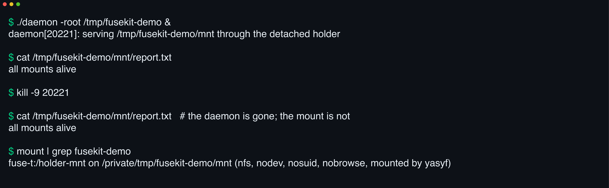

# 

**kill -9 the daemon. Every mount stays up.** fusekit parks each FUSE-T mount in a detached holder process, so daemon restarts, upgrades, and crashes never take a filesystem down.

[](https://github.com/yasyf/fusekit/actions/workflows/ci.yml)
[](https://github.com/yasyf/fusekit/releases)
[](LICENSE)

## Get started

```sh
go get github.com/yasyf/fusekit@latest
```



That capture is a real run — [docs/scripts/demo.sh](docs/scripts/demo.sh) regenerates it. The daemon dies mid-flight and the mount keeps serving, because the holder owns it. The root package and `fusekit/mountd` build pure with `CGO_ENABLED=0` on every platform; only a process that hosts mounts needs `-tags fuse` and cgo, against FUSE-T on macOS or libfuse3 on Linux.

Driving with an agent? Paste this:

```text
Run `go get github.com/yasyf/fusekit@latest` in my Go project.
Wire my mounts through mountd.RemoteHost so a detached holder keeps them alive across my daemon's restarts.
Read https://pkg.go.dev/github.com/yasyf/fusekit and docs/overlay.md for the overlay backends and holder protocol.
```

---

## Use cases

### Keep FUSE mounts alive through daemon restarts, upgrades, and crashes

When your daemon owns its mounts, every deploy drops them and every crash strands them. Hand them to a detached holder instead — `mountd.RemoteHost` spawns one when missing, adopts an already-live mirror with zero RPC, and drives mount and unmount over a unix socket:

```go
host := &mountd.RemoteHost{
    Socket:         socket,
    LogPath:        logPath,
    Args:           []string{"mount-holder", "--socket", socket}, // your holder argv
    CannotHostHint: "install the fuse build: brew install myapp",
}
if err := host.Setup(repoRoot, mountpoint); err != nil {
    // errors.Is(err, fusekit.ErrMountNotLive) → first-mount macOS TCC grant;
    // errors.Is(err, mountd.ErrCannotHost)    → a pure build that can't host one.
}
```

The demo above is this exact wiring: `kill -9` the driving process, and reads through the mountpoint keep answering. On upgrade, one `host.Converge(ctx)` call at startup retires a version-skewed holder and remounts everything it served.

### Serve one shared base dir as isolated per-tenant views

N tenants sharing one base directory can't share one filesystem view — each needs its own private entries over the common content. Declare the classification once in an `overlay.Spec` and let `overlay.Select` probe the machine:

```go
spec := overlay.Spec{
    IsPrivate: func(name string) bool { return name == "identity.json" },
    Skip:      map[string]bool{".DS_Store": true},
    Holder:    &overlay.HolderSpec{Socket: socket, Args: holderArgv, Version: version.String()},
}
provider, backend, reason, err := overlay.Select(ctx, spec)
// backend: fskit or nfs through the holder, else symlink — with the reason why
if err := provider.Setup(base, accountDir); err != nil {
    log.Fatal(err)
}
```

Each tenant dir becomes a live mirror of the base with its private names redirected to per-tenant backing, and the verdict degrades cleanly: no fuse build, no reachable holder, or a failed probe mount all fall back to symlinks with a human-readable reason.

### Tear down wedged NFS mounts before they freeze the machine

A dead FUSE-T mount is not inert — a stat on it hangs the caller, and a stack of them wedges the host. fusekit's teardown is bounded at every layer:

```go
_ = fusekit.ForceUnmount(dir) // graceful, then forced, then a mountpoint re-check
_ = fusekit.ClearCarcass(dir) // reap a dead holder's NFS carcass at dir
```

Mount and unmount run on timeout ladders with forced fallbacks, and every OK is re-verified against kernel state — a lost RPC response or a wedged mirror reads as the wedge it is, never as a clean teardown, so callers never `RemoveAll` through a live mount.

## Mount in-process

For a process that owns its own mount lifetime (built with `-tags fuse`), `Mount` returns as soon as the mount is live and the returned `Handle` owns bounded teardown:

```go
h, err := fusekit.Mount(fusekit.Config{
    Base:    repoRoot,   // dir whose contents the mount mirrors
    Dir:     mountpoint, // where the mount is served
    FS:      myFS,       // your fuse.FileSystemInterface
    Options: fusekit.MountOptions{Volname: "myapp", NoBrowse: true}.Build(),
    // Ready defaults to MountAlive(Base, Dir); set it for a synthetic tree
    // whose Base contents never show through.
})
if err != nil {
    // classify with errors.Is: fusekit.ErrFuseUnavailable (no fuse runtime),
    // fusekit.ErrMountNotLive (first-mount macOS TCC grant), fusekit.ErrMountTimeout.
}
defer h.Unmount()
```

`fusekit.Serve(ctx, cfg)` is the same mount for your process's whole lifetime: it blocks until `ctx` cancels or the mount is removed externally, then tears down. NFS attribute caching hides same-second edits; the opt-in `CacheDefeat` decorator (`Config.CacheDefeat`) bumps mtime nanoseconds and commits on both `Flush` and `Fsync`, so edits stay visible and a bad save fails loudly at `close(2)`.

## Host the holder

The holder is a subcommand of your own binary, built with `-tags fuse`. It wraps a `fusekit.MountSet` (the `mountd.Host` seam) and serves until signalled:

```go
srv := &mountd.Server{
    Socket:  socket,
    Version: version.String(), // your version on the wire, never fusekit's
    Host: &fusekit.MountSet{
        Build: func(spec fusekit.MountSpec) (fusekit.Config, error) {
            return fusekit.Config{
                Base: spec.Base, Dir: spec.Dir, FS: newFS(spec.Base),
                Options: fusekit.MountOptions{Volname: "myapp", NoBrowse: true}.Build(),
            }, nil
        },
        StateFn: func(base, dir string) (mounted, alive bool) {
            m := fusekit.Mounted(dir)
            return m, m && fusekit.MountAlive(base, dir)
        },
    },
}
if err := srv.Run(ctx); err != nil {
    log.Fatal(err)
}
```

The wire protocol is newline-JSON, versioned, and additive-only, so a newer client and an older holder interoperate in either direction. [cmd/holder](cmd/holder) is the ready-made serve-only variant that mirrors any base passthrough-style — the demo drives it unmodified.

Because the holder outlives your daemon, an upgrade leaves an old-version holder serving live mounts. Both retirement paths share one mechanic, `mountd.Retire`: graceful shutdown, a peer-gated reap of the pid captured at gate time, the successor spawn, then — invariant — a carcass force-unmount before the remount, so a wedged NFS mount cannot re-wedge the kernel. A CLI calls `RemoteHost.Converge` once at startup; a daemon drives a `proc.Supervisor` wired through `mountd.RetirePolicy`, which keeps a detached, versioned child alive under backoff and a crash-loop breaker. The godoc on both carries the full contract.

## Overlay backends

`overlay` realizes the same per-tenant view through three backends: `symlink` links each top-level base entry in-process, holder-free; `nfs` and `fskit` (macOS 26+, passthrough-only) serve a passthrough mirror through the detached holder. `overlay.Parse` is the only way in from a stored string, and `overlay.ProviderFor` reconstructs a provider from a recorded verdict without re-probing — it never silently substitutes backends.

The consumer stays blind to the mechanics. Beyond `Select` and `Setup`, the package owns the operational edges: `(Backend).Enablement()` names the macOS Settings pane and deep links a fuse backend needs before mounts come live, and the migration helpers (`MovePrivateEntries`, `MoveSharedOrphans`, `HasPrivateEntries`) move exactly the right entries between backends, surfacing every last-write-wins collision through `ResolvedConflictLogf`. For the architecture — why the fuse half lives out-of-process, how the private root works, and how conversions stay crash-safe — see [docs/overlay.md](docs/overlay.md).

## Package map

| Package | What it holds |
|---|---|
| `fusekit` | In-process mount lifecycle: `Config`, `Mount`/`Serve`, `Handle` teardown, `MountSet`, liveness probes, `CacheDefeat`, `ForceUnmount`/`ClearCarcass` |
| `fusekit/mountd` | The detached holder: `Server`, `Client`, `RemoteHost`, `Spawn`, `Retire`/`RetirePolicy`, frozen wire protocol — builds pure |
| `fusekit/overlay` | Three-backend per-tenant overlay: `Spec`, `Select`, `ProviderFor`, enablement and migration helpers |
| `fusekit/holderfs` | The shared holder's passthrough mirror filesystem (`-tags fuse`) |
| `fusekit/proc` | Stdlib-only process primitives: detached spawn, single-entrant bind, backoff, `Supervisor` |
| `fusekit/fuset` | macOS fuse-t facts: dylib path, Homebrew cask, install and FSKit availability |
| `fusekit/state` | A consumer's `~/.<App>` private state dir and atomic status mirror |
| `fusekit/service` | macOS LaunchAgent install and manage, reconciled with Homebrew services |
| `cmd/holder` | The dedicated serve-only holder binary |

The exhaustive contracts live in the [godoc](https://pkg.go.dev/github.com/yasyf/fusekit).

Used by [cc-pool](https://github.com/yasyf/cc-pool), [cc-notes](https://github.com/yasyf/cc-notes), and [cc-squash](https://github.com/yasyf/cc-squash). Licensed under [PolyForm Noncommercial 1.0.0](LICENSE).
